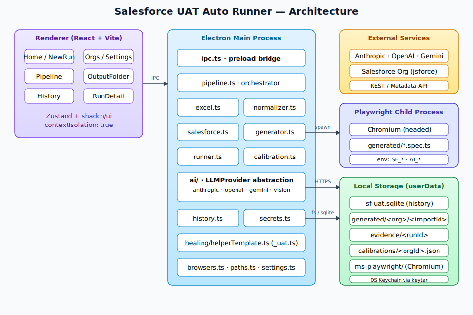
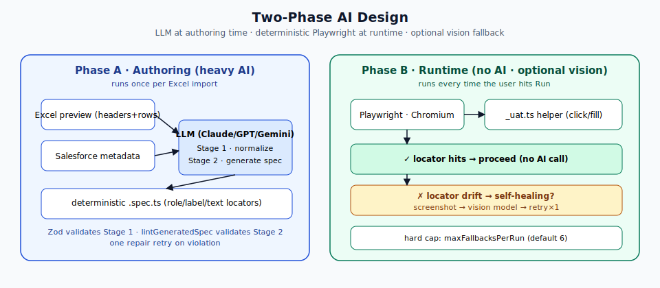
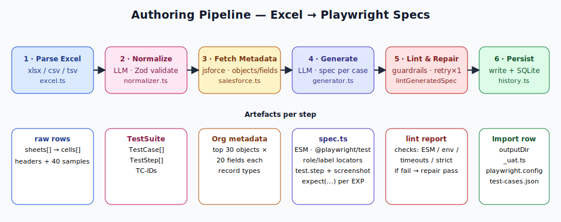
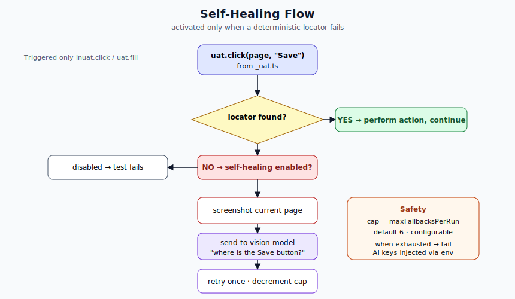
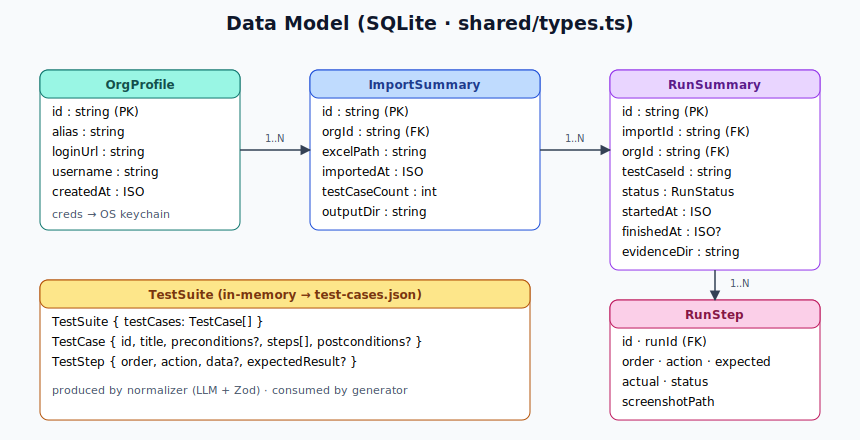
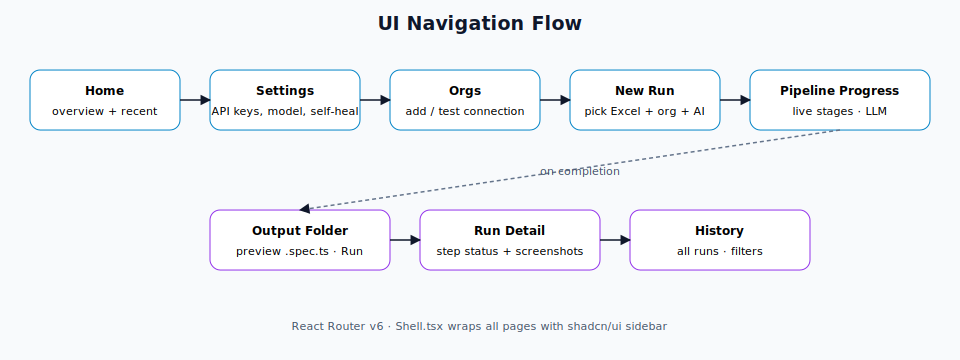

# Salesforce UAT Auto Runner — Τεχνικό Documentation

Αναλυτική τεκμηρίωση της desktop εφαρμογής που παράγει και τρέχει Playwright UAT scripts για Salesforce orgs, με χρήση LLM (Claude / ChatGPT / Gemini) στο authoring stage και deterministic automation στο runtime.

---

## Πίνακας Περιεχομένων

1. [Επισκόπηση](#1-επισκόπηση)
2. [Αρχιτεκτονική](#2-αρχιτεκτονική)
3. [Two-Phase AI Design](#3-two-phase-ai-design)
4. [Authoring Pipeline](#4-authoring-pipeline)
5. [Self-Healing](#5-self-healing)
6. [Μοντέλο Δεδομένων](#6-μοντέλο-δεδομένων)
7. [UI Flow](#7-ui-flow)
8. [Δομή Φακέλων](#8-δομή-φακέλων)
9. [Ασφάλεια](#9-ασφάλεια)
10. [Tech Stack](#10-tech-stack)
11. [Οδηγός Χρήσης](#11-οδηγός-χρήσης)

---

## 1. Επισκόπηση

Το **Salesforce UAT Auto Runner** είναι μια Electron desktop εφαρμογή που:

- Διαβάζει UAT test cases από Excel / CSV (οποιοδήποτε layout)
- Χρησιμοποιεί LLM για να κανονικοποιήσει τα δεδομένα σε δομημένο `TestSuite`
- Συνδέεται στο Salesforce org μέσω `jsforce` και αντλεί live metadata (objects, fields, record types)
- Παράγει ένα deterministic Playwright `.spec.ts` ανά test case με Lightning-friendly locators
- Τρέχει τα tests σε headed Chromium και κρατάει evidence (screenshots, trace, video)
- Αποθηκεύει όλη την ιστορικότητα σε τοπική SQLite ανά org

**Philosophy:** το AI χρησιμοποιείται μόνο στο *authoring time*. Στο runtime το Playwright τρέχει χωρίς AI — εκτός αν ενεργοποιηθεί το προαιρετικό **self-healing**, που κάνει μία vision κλήση όταν ένα locator αστοχήσει.

---

## 2. Αρχιτεκτονική



Η εφαρμογή χωρίζεται σε τρία επίπεδα:

| Layer | Τεχνολογία | Ρόλος |
|-------|------------|-------|
| **Renderer** | React 18 + Vite + Tailwind + shadcn/ui | UI pages (Home, NewRun, Orgs, Settings, History, RunDetail) |
| **Main Process** | Electron 33 + Node 20 | IPC bridge, pipeline orchestration, Playwright spawn, SQLite, keychain |
| **External** | Anthropic · OpenAI · Gemini · Salesforce (jsforce) · Chromium | LLM calls + org metadata + browser execution |

### Βασικοί modules του main process

| File | Ρόλος |
|------|-------|
| `electron/main/ipc.ts` | Rip κανάλια (`IpcChannels`) προς το preload |
| `electron/main/services/pipeline.ts` | Orchestrator των 5 σταδίων του authoring |
| `electron/main/services/excel.ts` | Parse xlsx/xls/xlsm/csv/tsv → raw rows |
| `electron/main/services/normalizer.ts` | LLM Stage 1: rows → `TestSuite` |
| `electron/main/services/salesforce.ts` | `jsforce` metadata fetch (objects + fields) |
| `electron/main/services/generator.ts` | LLM Stage 2: `TestCase` + metadata → `.spec.ts` |
| `electron/main/services/runner.ts` | Spawn Playwright, stream progress, inject env vars |
| `electron/main/services/healing/helperTemplate.ts` | `_uat.ts` helper που πέφτει σε κάθε output dir |
| `electron/main/services/calibration.ts` | Optional headed capture των πραγματικών labels/fields |
| `electron/main/services/history.ts` | SQLite repositories (`OrgsRepo`, `ImportsRepo`, `RunsRepo`) |
| `electron/main/services/secrets.ts` | `keytar` για keys (AI + Salesforce) |
| `electron/main/services/ai/` | Ενοποιημένο `LLMProvider` interface (anthropic/openai/gemini/vision) |

---

## 3. Two-Phase AI Design



### Phase A — Authoring (heavy AI)

Τρέχει **μία φορά** ανά Excel import. Το LLM βλέπει:

- **Stage 1 — Normalizer** (`normalizer.ts`): preview των sheets (headers + έως 40 δείγματα γραμμών, `key=value` ανά cell). Παράγει `TestSuite` JSON, validated με Zod. Αν αποτύχει το parsing → user-visible error.
- **Stage 2 — Generator** (`generator.ts`): login URL, compact metadata summary (top 30 objects × 20 fields), και το πλήρες `TestCase` JSON. Παράγει `.spec.ts` με:
  - ESM `@playwright/test` import
  - env-var credentials (`SF_USERNAME`, `SF_PASSWORD`, ...)
  - Lightning-friendly locators σε προτεραιότητα: `role` → `label` → `text`
  - κανένα hardcoded timeout
  - `test.step` ανά action με screenshot
  - `expect(...)` assertions ανά expected result
  - strict 180s timeout

Μετά το generation τρέχει `lintGeneratedSpec`. Αν παραβιαστεί οποιοσδήποτε κανόνας → μία repair retry με explicit instructions.

### Phase B — Runtime (no AI)

Τρέχει κάθε φορά που ο χρήστης πατά **Run**. Το Playwright εκτελεί το `.spec.ts` σε headed Chromium. **Χωρίς AI κλήσεις**, εκτός αν είναι ενεργό το self-healing και αστοχήσει κάποιο locator.

---

## 4. Authoring Pipeline



Το `pipeline.ts` εκπέμπει `PipelineProgress` events σε κάθε στάδιο ώστε το renderer να ανανεώνει live:

```ts
type PipelineStage =
  | 'parsing_excel'
  | 'normalizing'
  | 'fetching_metadata'
  | 'generating'
  | 'linting'
  | 'done'
  | 'error'
```

### Αναλυτικά

1. **Parse Excel** — `excel.ts` διαβάζει όλα τα sheets και κρατάει raw rows για το LLM.
2. **Normalize** — ο `normalizer` φτιάχνει `TestSuite` με:
   - διακριτά test cases
   - διατήρηση υπάρχοντος ID ή αυτόματα `TC-NNN`
   - merge σε split rows
   - απόρριψη decoration rows
3. **Fetch Metadata** — `jsforce.describeGlobal` + `describeSObject` για τα objects που εμφανίζονται στα cases.
4. **Generate** — ένα spec ανά test case. Παράγει παράλληλα σε batches και emits progress.
5. **Lint & Repair** — guardrails (ESM, env, timeouts, strict mode). Σε violation → one repair pass.
6. **Persist** — γράφει:
   - `generated/<orgAlias>/<importId>/*.spec.ts`
   - `_uat.ts` helper
   - `playwright.config.ts`
   - `test-cases.json`
   - `README.md`
   - row στην SQLite (`ImportsRepo`)

---

## 5. Self-Healing



**Ενεργοποίηση:** Settings → Self-healing → ON. Disabled by default.

Όταν ένα `uat.click(...)` ή `uat.fill(...)` (από το `_uat.ts` helper) αποτυγχάνει να βρει locator:

1. Το helper τραβά screenshot της τρέχουσας σελίδας.
2. Στέλνει το screenshot + ένα φυσικό description (π.χ. *"where is the Save button?"*) στο configured vision model.
3. Δοκιμάζει μία φορά το locator που προτείνει το model.
4. Μειώνει το counter `maxFallbacksPerRun` (default 6).
5. Όταν εξαντληθεί το cap → το test fails κανονικά.

**Safety:** το AI δεν καλείται ποτέ σε επιτυχημένα runs. Το hard cap κρατάει το κόστος φραγμένο. API keys περνούν μέσω env vars στο Playwright child process.

---

## 6. Μοντέλο Δεδομένων



Οι κύριες οντότητες ζουν στο `shared/types.ts` και αποθηκεύονται σε SQLite μέσω `better-sqlite3`:

- **OrgProfile** → Salesforce org metadata (creds πάνε keychain)
- **ImportSummary** → ένα row ανά Excel import (1..N από `OrgProfile`)
- **RunSummary** → ένα row ανά execution (1..N από `ImportSummary`)
- **RunStep** → βήματα με status/screenshot (1..N από `RunSummary`)
- **TestSuite / TestCase / TestStep** → in-memory contract, persisted σε `test-cases.json`

### Status lifecycle

```
pending → running → passed
                 ↘ failed
                 ↘ error
```

---

## 7. UI Flow



Η πλοήγηση ελέγχεται από `react-router-dom` v6. Όλες οι σελίδες περιβάλλονται από `Shell.tsx` (sidebar + topbar).

| Σελίδα | Περιεχόμενο |
|--------|-------------|
| **Home** | Σύνοψη + τελευταία imports/runs |
| **Settings** | AI provider + model, API keys (keytar), self-healing toggle, slowMo, theme |
| **Orgs** | Λίστα orgs, add/edit/delete, test connection |
| **New Run** | File picker + org picker + AI picker → start pipeline |
| **Pipeline Progress** | Live streaming των 5 σταδίων με progress bar |
| **Output Folder** | Preview των generated `.spec.ts` + κουμπί Run |
| **Run Detail** | Step-by-step status, screenshots, link σε trace/video |
| **History** | Φίλτρα ανά org / date / status |

---

## 8. Δομή Φακέλων

```
Salesforce-Automation-App-Test-Cases/
├── electron/
│   ├── main/
│   │   ├── services/
│   │   │   ├── ai/            # LLMProvider (anthropic, openai, gemini, vision)
│   │   │   ├── healing/       # _uat.ts helperTemplate
│   │   │   ├── browsers.ts    # Chromium path resolver
│   │   │   ├── calibration.ts # Optional headed capture
│   │   │   ├── excel.ts
│   │   │   ├── generator.ts
│   │   │   ├── history.ts
│   │   │   ├── normalizer.ts
│   │   │   ├── paths.ts
│   │   │   ├── pipeline.ts
│   │   │   ├── runner.ts
│   │   │   ├── salesforce.ts
│   │   │   ├── secrets.ts
│   │   │   └── settings.ts
│   │   ├── index.ts           # Electron bootstrap
│   │   └── ipc.ts             # IPC handlers
│   └── preload/
│       └── index.ts           # contextBridge API
├── shared/
│   ├── ipc.ts                 # IpcChannels enum
│   └── types.ts               # TestSuite/RunSummary/AppSettings...
├── src/
│   ├── pages/                 # Home · NewRun · Orgs · Settings · History · RunDetail · OutputFolder · PipelineProgress
│   ├── components/            # Shell + shadcn/ui primitives
│   ├── App.tsx
│   └── main.tsx
├── samples/
│   └── sample-uat.csv         # Παράδειγμα για smoke test
├── docs/
│   ├── DOCUMENTATION.md       # (αυτό το αρχείο)
│   └── images/                # SVG διαγράμματα
├── setup.sh                   # One-shot installer
├── electron-builder.yml
├── electron.vite.config.ts
└── package.json
```

### Runtime artefacts (userData)

```
<userData>/
├── generated/<orgAlias>/<importId>/   # *.spec.ts, _uat.ts, playwright.config.ts, test-cases.json
├── evidence/<runId>/                  # screenshots, trace.zip, videos
├── calibrations/<orgId>.json          # Optional — από Calibrate org
├── ms-playwright/                     # Chromium cache
└── sf-uat.sqlite                      # Runs / imports / orgs history
```

---

## 9. Ασφάλεια

- **OS keychain** via `keytar` για AI API keys + Salesforce creds. Ποτέ plaintext στο disk.
- **Playwright child process** παίρνει credentials μόνο από env vars:
  - `SF_USERNAME`, `SF_PASSWORD`, `SF_SECURITY_TOKEN`, `SF_LOGIN_URL`
  - Αν self-healing ενεργό: `SF_AI_PROVIDER`, `SF_AI_MODEL`, `SF_AI_VISION_MODEL`, `SF_AI_API_KEY`, `SF_AI_MAX_FALLBACKS`
- **Renderer** με `contextIsolation: true`, `nodeIntegration: false`, strict CSP.
- **Generated specs** δεν εμπεριέχουν secrets — πάντα `process.env.SF_*`.

---

## 10. Tech Stack

### Runtime
- **Electron 33** (main + renderer)
- **Node.js 20+**
- **React 18** · **Vite 5** · **Tailwind 3** · **shadcn/ui** (Radix)
- **Zustand** για state
- **React Router v6**

### Domain
- **`@playwright/test` 1.48** — browser automation
- **`jsforce` 3.6** — Salesforce API
- **`better-sqlite3` 11.5** — embedded DB
- **`keytar` 7.9** — OS keychain
- **`xlsx` 0.20.3 (CDN)** — spreadsheet parsing
- **`zod` 3.23** — runtime schema validation

### AI SDKs
- **`@anthropic-ai/sdk` 0.30** (Claude)
- **`openai` 4.104** (ChatGPT)
- **`@google/generative-ai` 0.21** (Gemini)

### Build/Package
- **`electron-vite` 2.3** — dev & build
- **`electron-builder` 25.1** — mac/win/linux installers

---

## 11. Οδηγός Χρήσης

### Install (macOS/Linux)

```bash
chmod +x setup.sh
./setup.sh
```

Κατεβάζει Node deps + ξανακτίζει native modules + pre-fetches Chromium.

### Dev mode

```bash
npm run dev
```

Τυπικό flow:

1. **Settings** → paste API key (Claude / OpenAI / Gemini) και επέλεξε default model.
2. **Orgs** → πρόσθεσε Salesforce org (alias, login URL, username, password, optional security token).
3. **New Run** → pick Excel, pick org, pick AI provider, Generate.
4. **Output Folder** → preview `.spec.ts`, πάτα **Run** και παρακολούθησε το browser live.
5. **History** → δες παλαιότερα runs με screenshots/trace.

### Optional toggles

- **Self-healing** (Settings) — AI vision fallback σε locator drift. Hard cap per run.
- **Calibrate org** (Orgs) — headed one-time capture των πραγματικών button/field labels ενός org. Γίνεται extra context για τον generator.

### Packaging

```bash
npm run package:mac    # ή package:win / package:linux
```

Το Chromium κατεβαίνει στο first launch του packaged app μέσα στο `userData/ms-playwright`.

---

## Παραπομπές

- `AGENTS.md` — συμβόλαια των LLM prompts
- `README.md` — quickstart + troubleshooting
- `shared/types.ts` — canonical data contracts
- `shared/ipc.ts` — IPC channel registry
